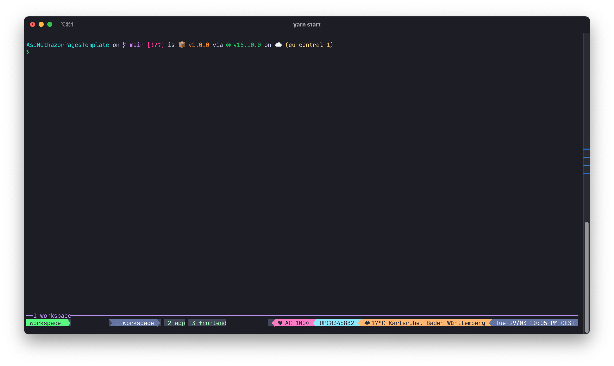
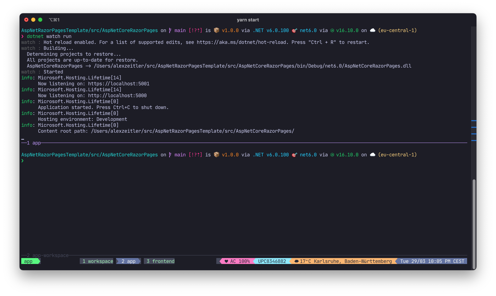
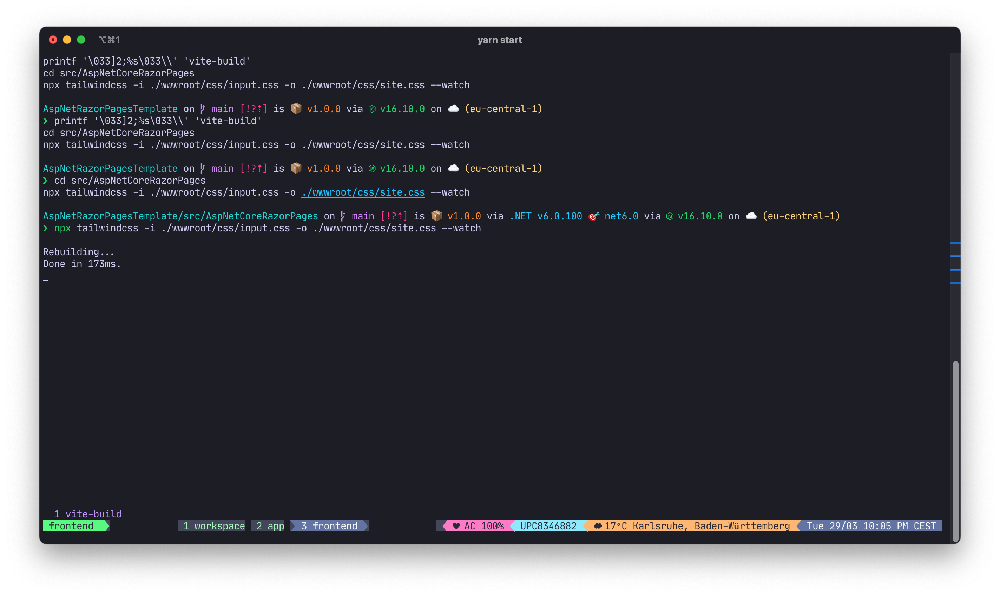
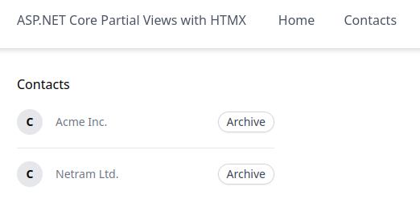

# AspNet (Core)  MVC Template

This is an ASP.NET Core Sample for [HTMX Template Fragments](https://htmx.org/essays/template-fragments/)

It contains

* a .NET 6 Solution
* a ASP.NET Core MVC 6 project
* HTMX
* HTMX .NET extensions
* TailwindCSS 3 including hot reload (JIT)
* tmux/tmuxinator windows / panes for development
* MartenDb Document Store based on Postgres

## Usage

```
yarn install
cd src/AspNetPartialViewsHtmx
yarn install
libman restore
```

#### Development

```
yarn start
```

`tmuxinator` starts a new session with three windows:

##### Workspace


##### App (.NET output)


##### Frontend (tailwind build)


Browse https://localhost:5001/contacts



## Known issues

* Not tested on Windows
* JetBrains Rider code completion does not work for TailwindCSS 3 JIT mode in `.cshtml` files [currently](https://youtrack.jetbrains.com/issue/RIDER-58725).
